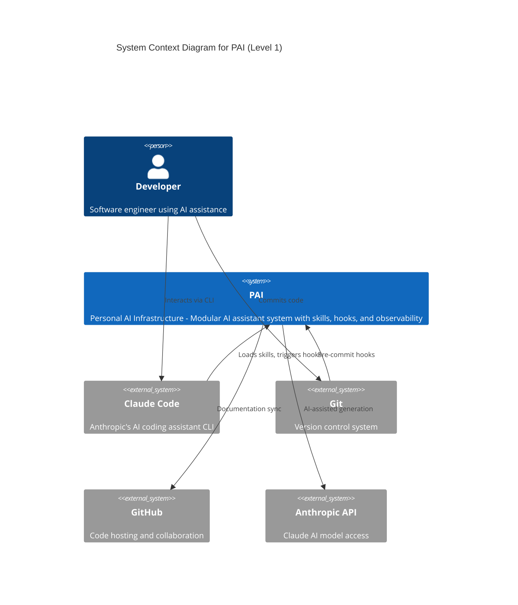
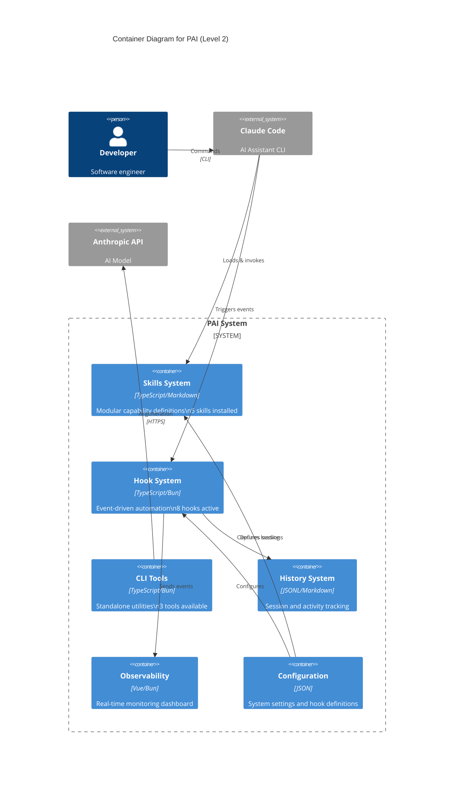
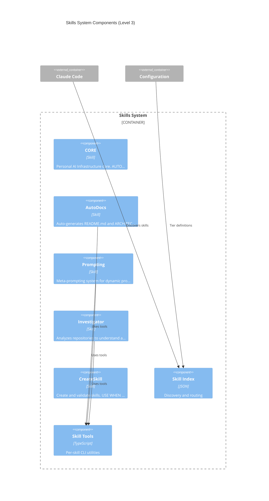
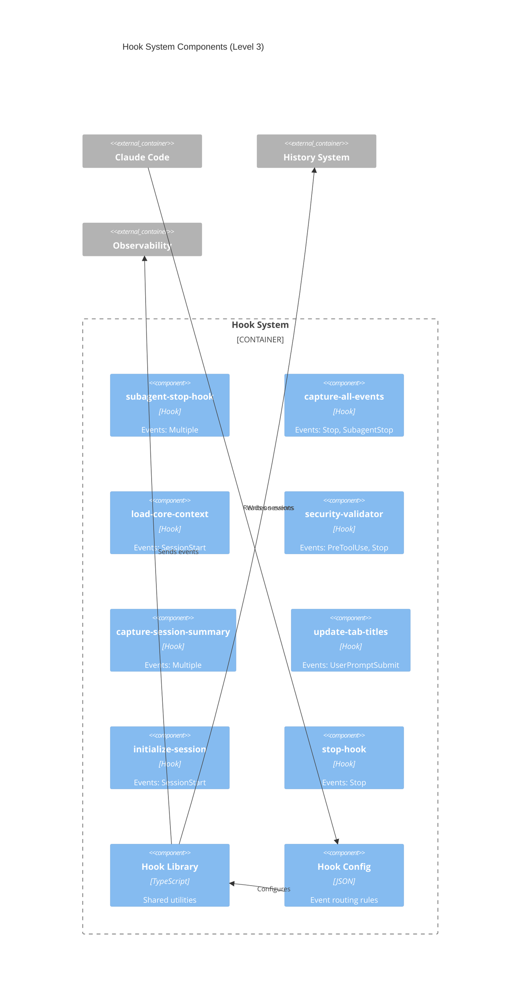

# PAI Architecture

> C4 Model documentation for Personal AI Infrastructure

**Last Updated:** 2026-01-08

## Overview

Personal AI Infrastructure - Modular AI assistant with skills, hooks, and observability

PAI is designed around a modular, event-driven architecture that integrates deeply with Claude Code. The system emphasizes:

- **Modularity**: Skills can be added, removed, or updated independently
- **Observability**: All events are captured and can be monitored in real-time
- **Extensibility**: Hooks allow custom behavior at every lifecycle event
- **AI-First**: Designed to leverage AI for documentation, code generation, and automation

## Technology Stack

| Layer | Technology | Purpose |
|-------|------------|---------|
| Runtime | Bun | Fast JavaScript/TypeScript runtime |
| Language | TypeScript | Type-safe development |
| Templates | Handlebars | Dynamic content generation |
| Diagrams | Mermaid | Architecture visualization |
| AI | Anthropic Claude | AI-assisted generation |
| Frontend | Vue 3 + Vite | Observability dashboard |

## C4 Model Diagrams

### Level 1: System Context

Shows PAI in relation to users and external systems.



**Key External Systems:**
- **Claude Code**: The AI assistant CLI that loads and invokes PAI
- **Anthropic API**: Provides AI model access for generation tasks
- **Git/GitHub**: Version control and documentation sync

### Level 2: Container Diagram

Major subsystems within PAI and their interactions.



**Container Descriptions:**

| Container | Technology | Responsibility |
|-----------|------------|----------------|
| Skills System | TypeScript/Markdown | Modular capability definitions |
| Hook System | TypeScript/Bun | Event-driven automation |
| CLI Tools | TypeScript/Bun | Standalone utilities |
| History System | JSONL/Markdown | Session and activity tracking |
| Observability | Vue/Bun | Real-time monitoring |
| Configuration | JSON | System settings |

### Level 3: Component Diagrams

Detailed breakdown of each major container.

#### Skills System



#### Hook System



#### CLI Tools

```mermaid
C4Component
    title CLI Tools Components (Level 3)

    Container_Boundary(tools, "CLI Tools") {
        Component(tool_skillsearch, "SkillSearch", "CLI Tool", "SkillSearch.ts")
        Component(tool_paiarchitecture, "PaiArchitecture", "CLI Tool", "PaiArchitecture.ts")
        Component(tool_generateskillindex, "GenerateSkillIndex", "CLI Tool", "GenerateSkillIndex.ts")
        Component(tool_c4generator, "C4Generator", "CLI Tool", "C4Generator.ts - Generate C4 arc...")
        Component(tool_changedetector, "ChangeDetector", "CLI Tool", "ChangeDetector.ts - Detect when ...")
        Component(tool_codeanalyzer, "CodeAnalyzer", "CLI Tool", "CodeAnalyzer.ts - Extract projec...")
        Component(tool_autodocs, "AutoDocs", "CLI Tool", "AutoDocs.ts - Template-Based Doc...")
        Component(tool_rendertemplate, "RenderTemplate", "CLI Tool", "RenderTemplate.ts - Template Ren...")
        Component(tool_validatetemplate, "ValidateTemplate", "CLI Tool", "ValidateTemplate.ts - Template S...")
        Component(tool_paiinvestigate, "PaiInvestigate", "CLI Tool", "PaiInvestigate.ts - Repository S...")
    }

    Container_Ext(skills, "Skills System")
    Container_Ext(anthropic, "Anthropic API")
    Container_Ext(filesystem, "File System")

    Rel(skills, tools, "Invokes")
    Rel(tools, anthropic, "AI generation")
    Rel(tools, filesystem, "Read/Write files")
```


## Data Flow

### Session Lifecycle

```
User Input → Claude Code → PAI Skills
                ↓
        Hook Events Triggered
                ↓
    ┌───────────┼───────────┐
    ↓           ↓           ↓
 History    Observability  Tools
 (JSONL)    (Dashboard)    (CLI)
```

### Skill Loading Flow

```
Session Start
    ↓
load-core-context.ts hook
    ↓
Read skill-index.json
    ↓
Load "always" tier skills
    ↓
On-demand: Load "deferred" skills
```

## Installed Skills

### CORE

**Path:** `skills/CORE/SKILL.md`

Personal AI Infrastructure core. AUTO-LOADS at session start. USE WHEN any session begins OR user asks about identity, response format, contacts, stack preferences, security protocols, or asset management.


### AutoDocs

**Path:** `skills/AutoDocs/SKILL.md`

Auto-generates README.md and ARCHITECTURE.md documentation. USE WHEN git pre-commit triggers OR user requests documentation generation OR user says &quot;generate readme&quot; OR &quot;update architecture&quot; OR &quot;generate docs&quot;.


**Tools:**
- `C4Generator`: C4Generator.ts - Generate C4 architecture diagrams in Mermaid syntax
- `ChangeDetector`: ChangeDetector.ts - Detect when documentation needs updating
- `CodeAnalyzer`: CodeAnalyzer.ts - Extract project metadata for documentation generation
- `AutoDocs`: AutoDocs.ts - Template-Based Documentation Generator

### Prompting

**Path:** `skills/Prompting/SKILL.md`

Meta-prompting system for dynamic prompt generation using templates, standards, and patterns. USE WHEN meta-prompting, template generation, prompt optimization, or programmatic prompt composition.


**Tools:**
- `RenderTemplate`: RenderTemplate.ts - Template Rendering Engine
- `ValidateTemplate`: ValidateTemplate.ts - Template Syntax Validator

### Investigator

**Path:** `skills/Investigator/SKILL.md`

Analyzes repositories to understand architecture and provide implementation guidance. USE WHEN investigate repo OR analyze codebase OR understand architecture OR how to implement OR explore project structure OR onboard to new project.


**Tools:**
- `PaiInvestigate`: PaiInvestigate.ts - Repository Signal Collector for Investigation
- `Prompts`: Prompts.ts - Fixed Investigator Prompt Template
- `Schema`: Schema.ts - TypeScript interfaces for Investigation
- `Collect`: Collect.ts - Deterministic Repository Signal Collection
- `Report`: Report.ts - Investigation Report Storage and Rendering

### CreateSkill

**Path:** `skills/CreateSkill/SKILL.md`

Create and validate skills. USE WHEN create skill, new skill, skill structure, canonicalize. SkillSearch(&#x27;createskill&#x27;) for docs.


## Hook System

Hooks are triggered at various lifecycle events. All hooks are defined in `config/settings-hooks.json`.

| Hook | Events | Purpose |
|------|--------|---------|
| subagent-stop-hook |  | Event handler |
| capture-all-events | Stop, SubagentStop | Event handler |
| load-core-context | SessionStart | Event handler |
| security-validator | PreToolUse, Stop | Event handler |
| capture-session-summary |  | Event handler |
| update-tab-titles | UserPromptSubmit | Event handler |
| initialize-session | SessionStart | Event handler |
| stop-hook | Stop | Extract the last assistant response from... |

### Event Types

- **SessionStart**: When a Claude Code session begins
- **SessionEnd**: When a session ends
- **PreToolUse**: Before a tool is invoked
- **PostToolUse**: After a tool completes
- **Stop**: When main agent stops
- **SubagentStop**: When a subagent completes
- **UserPromptSubmit**: When user submits input

## Directory Structure

```
pai/
├── skills/    # Modular skill definitions and workflows
├── hooks/    # Event-driven automation handlers
├── tools/    # Standalone CLI utilities
├── config/    # System configuration files
├── history/    # Session and activity tracking
├── observability/    # Monitoring and dashboard
├── docs/    # Generated documentation
├── .autodocs-state.json    # Documentation generation state
└── .env                    # Environment configuration
```

## Architectural Decisions

### Why Bun?

Bun provides faster startup times and native TypeScript support, which is critical for hooks that run on every Claude Code event.

### Why JSONL for History?

JSONL (JSON Lines) format allows:
- Append-only writes (no file locking)
- Easy streaming and tailing
- Line-by-line processing for large files

### Why Handlebars Templates?

Handlebars offers:
- Familiar mustache-style syntax
- Custom helpers for complex logic
- Separation of content from presentation

---

*Architecture documentation auto-generated by PAI AutoDocs*
